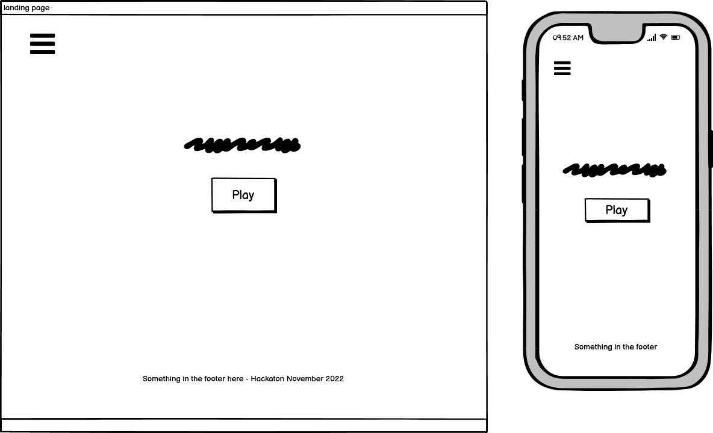
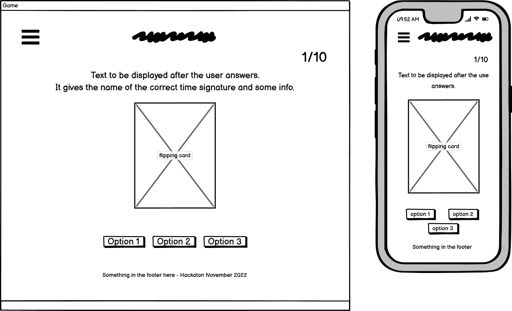
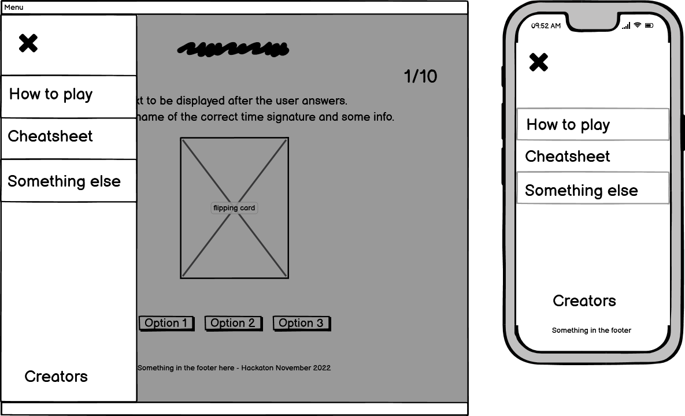
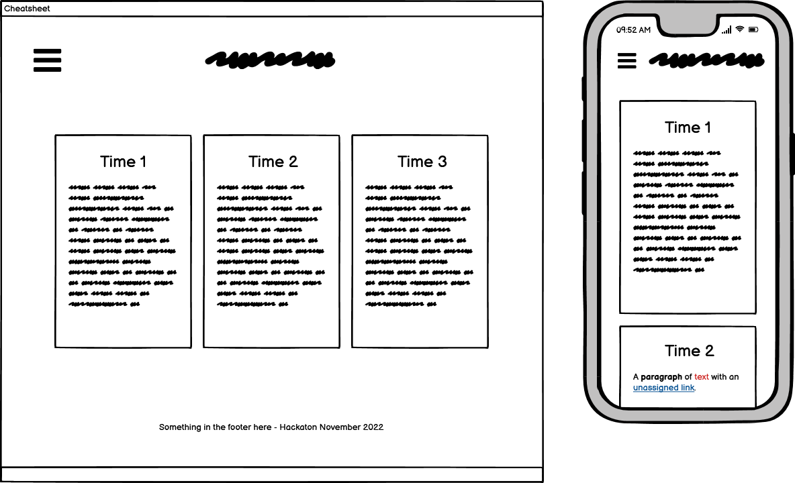
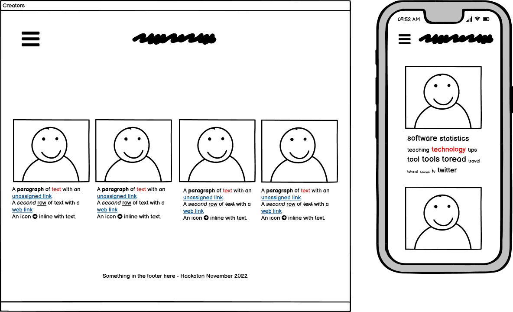

# Time signature

## Table of content

- [Design and User Experience](#design-and-user-experience)
  - [Design](#design)
  - [User Experience](#user-experience)
  - [Wireframes](#wireframes)

- [Features](#features)

- [Testing](#testing)
  - [Tests](#tests)
  - [Validator Testing](#validator-testing)
  - [Fixed bugs](#fixed-bugs)
  - [Unfixed bugs](#unfixed-bugs)
  - [Performance](#performance)

- [Deployment](#deployment)
  - [Live Website](#live-website)
  - [Local Deployment](#local-deployment)

- [Credits](#credits)
  - [Content](#content)
  - [Media](#media)

- [Technologies used](#technologies-used)

## Design and User Experience

### Design

### User Stories

### Wireframes

Landing page

Game page

Side menu

Cheatsheets

Creators

## Features 

## Testing 

### Validator Testing

### Fixed Bugs

### Unfixed Bugs

### Performance

## Deployment

### Live Website

- The site was deployed to GitHub pages. The steps to deploy are as follows: 
  - In the GitHub repository, navigate to the Settings tab 
  - From the source section drop-down menu, select the Master Branch
  - Once the master branch has been selected, the page will be automatically refreshed with a detailed ribbon display to indicate the successful deployment. 

The live link can be found here - [Live Website]()

### Local Deployment
  - For a local deployment follow these steps:
    - Create a new directory on your machine, where you want do deploy the files
    - Open the existing repository in GitHub
    - Go to the "Code" tab
    - Click on the "Code" button
    - Copy the HTTPS link
    - Open your terminal and run the command __git clone 'link'__
    - use the link just copied, without quotes, instead of 'link'

## Credits 

### Content

### Media

- The treble clef icon is from [Icons8](https://icons8.com/icon/mwHGeE4mJtWI/treble-clef)

## Technologies used

  - HTML
  - CSS
  - JavaScript
  - Bootstrap
