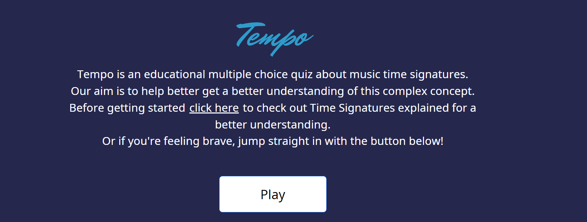

# Tempo

- [Introduction](#introduction)

## Introduction

'Tempo' is a music time signature identification game. It is done in a multiple choice question and answers style.
Music time signatures is an abstract concept and quite difficult to understand. In my years as a private music tutor It was one of the concepts students struggled with the most. With this game and the accompanying info page we hope to make this concept more understandable and fun to learn. The target audience for this game would be people who are already learning music theory and want to get a better understanding. It's not ideal for people with little to no music

## Deployed Link

Live website is deployed here: https://awssg.github.io/time-signature/

### How to play

Once on the page you click the "play" button at the bottom of the landing page or "play game" button at the bottom of the "Time Signatures Explained" page. Once the game starts you listen to the audio file by clicking the play button. Below you have multiple choice answers. Pick the answer you think is correct and once submitted a card will pop up telling you whether you got it right or wrong. If the answer is wrong you will be told what the right answer is. There is a question counter in the corner so you know how many questions are left to answer.

## Credits

Treble Clef icon by [Icons8](https://icons8.com/icon/mwHGeE4mJtWI/treble-clef)